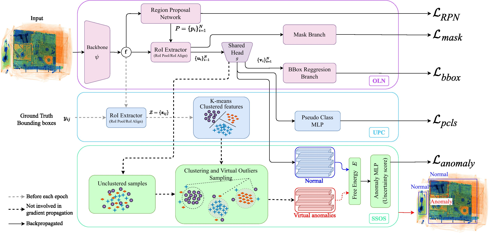
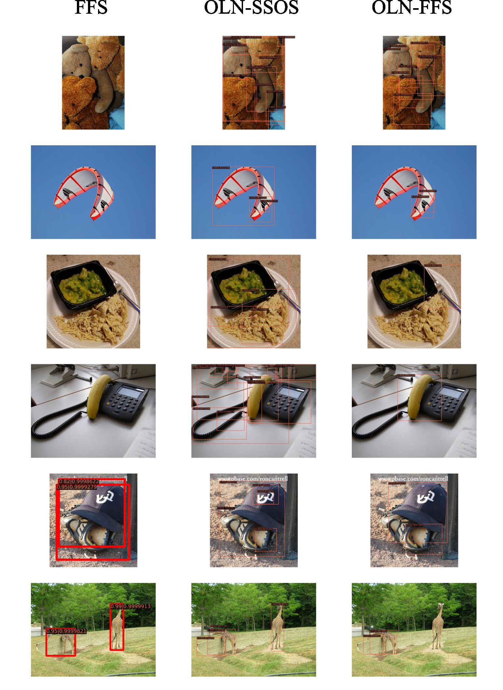
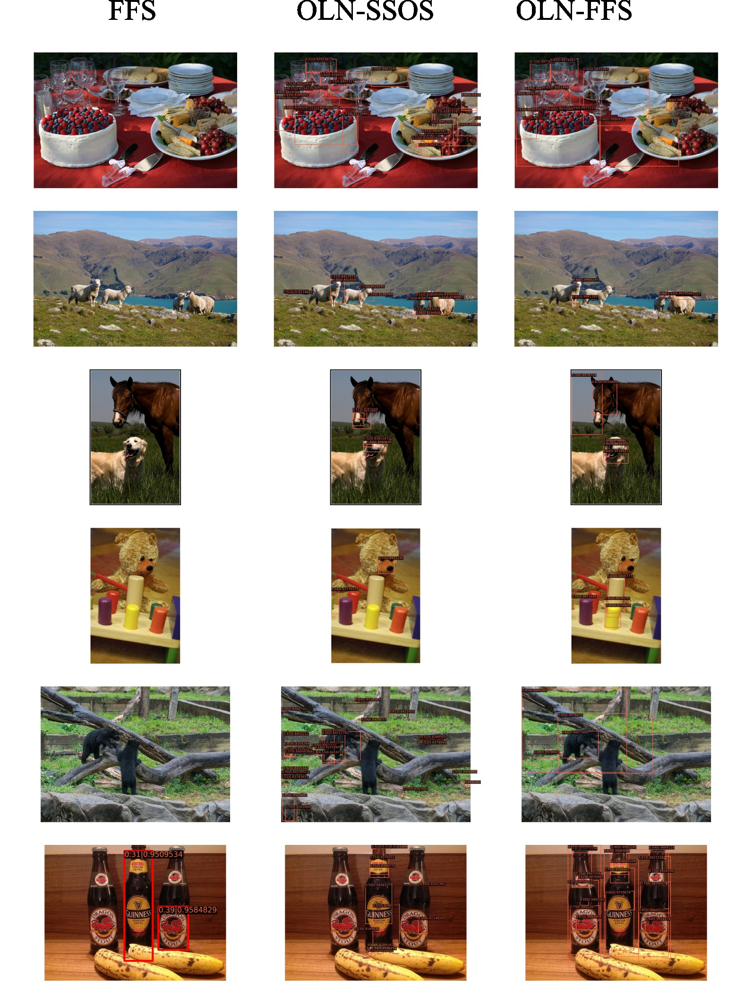
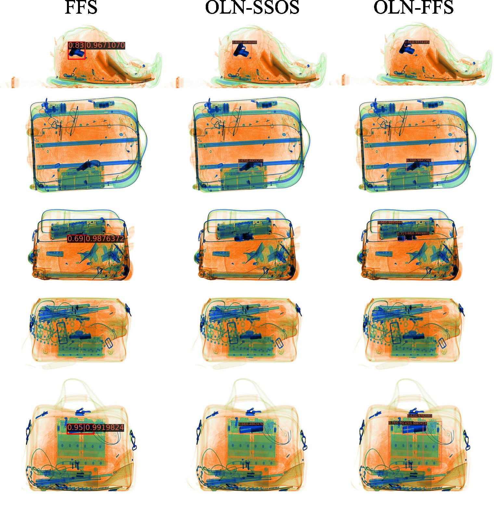
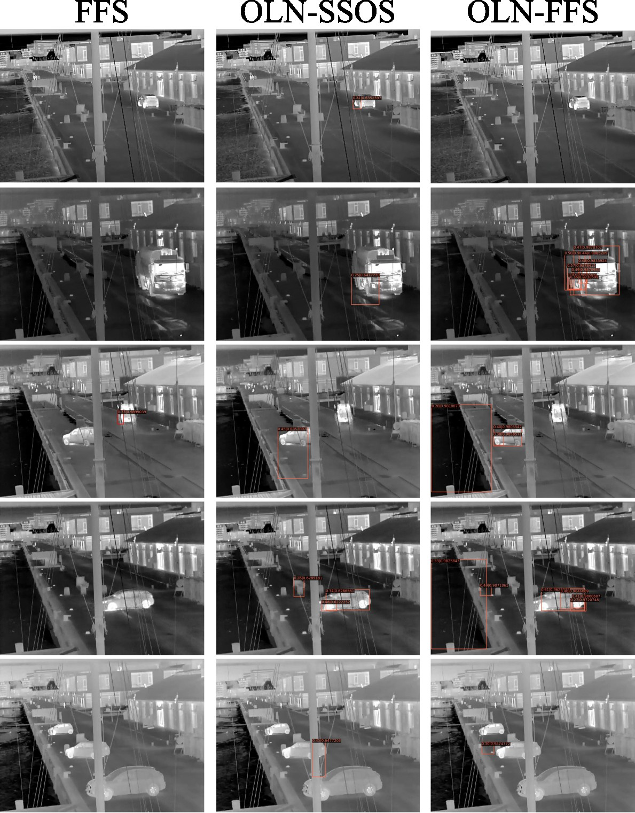

## Abstract

Object detection is a pivotal task in computer vision that has received significant attention in previous years. Nonetheless, the capability of a detector to localise objects out of the training distribution remains unexplored. Whilst recent approaches in object-level out-of-distribution (OoD) detection heavily rely on class labels, such approaches contradict truly open-world scenarios where the class distribution is often unknown. In this context, anomaly detection focuses on detecting unseen instances rather than classifying detections as OoD. This work aims to bridge this gap by leveraging an open-world object detector and an OoD detector via virtual outlier synthesis. This is achieved by using the detector backbone features to first learn object pseudo-classes via self-supervision. These pseudo-classes serve as the basis for class-conditional virtual outlier sampling of anomalous features that are classified by an OoD head. Our approach empowers our overall object detector architecture to learn anomaly-aware feature representations without relying on class labels, hence enabling truly open-world object anomaly detection. Empirical validation of our approach demonstrates its effectiveness across diverse datasets encompassing various imaging modalities (visible, infrared, and X-ray). Moreover, our method establishes state-of-the-art performance on object-level anomaly detection, achieving an average recall score improvement of over 5.4% for natural images and 23.5% for a security X-ray dataset compared to the current approaches. In addition, our method detects anomalies in datasets where current approaches fail. 

## Results

## Citation
    
    @inproceedings{isaac-medina24oln-ssos,
     author = {Isaac-Medina, B.K.S. and Gaus, Y.F.A. and Bhowmik, N. and Breckon, T.P.},
     title = {Towards Open-World Object-based Anomaly Detection via Self-Supervised Outlier Synthesis},
     booktitle = {Proc. European Conference on Computer Vision },
     year = {2024},
     month = {September},
     publisher = {Springer},
     keywords = {x-ray, thermal, anomaly detection, open world object detection, open-set anonaly detection, object-wise anomaly detection},
     url = {https://breckon.org/toby/publications/papers/isaac24ssos.pdf},
     arxiv = {https://arxiv.org/abs/2407.15763},
     note = {to appear},
     category = {anomaly baggage automotive},
    }
    